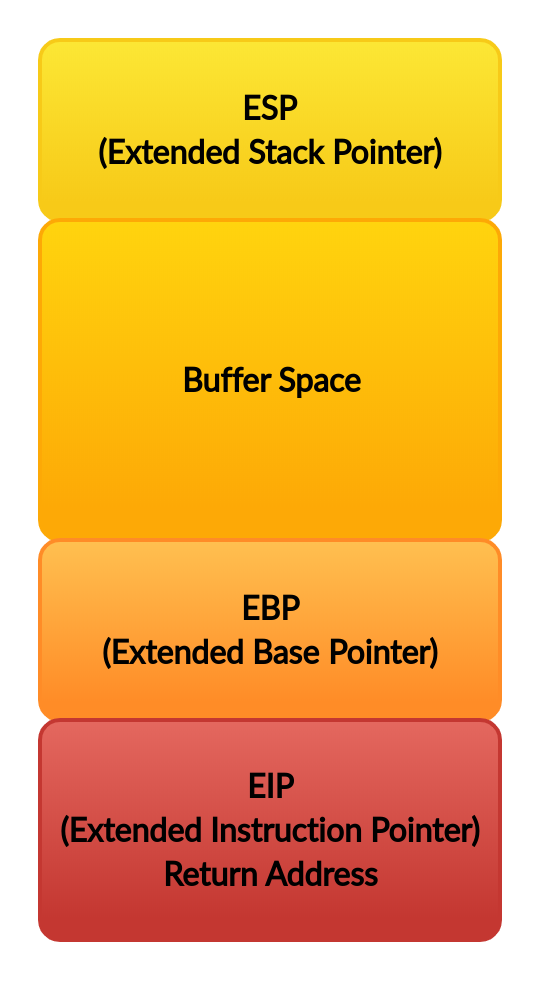

## Buffers Overflows: ¿Que son?

En la programación, se denomina buffer a un espacio de memoria, donde se almacenan ciertos tipos de datos, normalmente se utiliza a la ahora de desarrollo un software o hardware para almacenar y regular datos que luego necesitara el programa o equipo, puede encontrar más información [aquí](https://es.m.wikipedia.org/wiki/B%C3%BAfer_de_datos)

Cuando se declara un buffer con un tamaño prefijado y luego no se controla la cantidad de datos que en el son introducidos, ocurre un desbordamiento, lo que al inglés se traduce como *Buffer Overflow*

**Sintaxis**: `type array[longitud_buffer]`

**Ejemplo**: `char input[50]; //se declara un array que admite 50 caracteres`
           `variable1 = input[49] //máximo`
           `variable2 = input[250] //acceder a la memoria fuera de la array`

**El Stack(Pila)**

La pila o el stack es donde se almacenan los argumentos pasados al programa, las strings del entorno donde está siendo ejecutado el binario, los argumentos pasados a las funciones, las variables locales vacías, y además es donde se almacena el registro IP cuando una función es llamada.

**Ejemplo**

```c++
func() {  
  array[50]  
  return
}  

main() {  
  var1  
  func()  
}  
```


**Registros(x86)**

`EBP`: Extended Base Pointer
    
* Apunta a la base del stack

`ESP`: Extended Stack Pointer
 
* Señala la parte superior del stack

`EIP`: Extended Instruction Pointer
 
* Dirección de retorno



Existen otros registros(x86) de que tocaremos más adelante pero estos son los más importantes.

**¿Como se explota esto?**

Podemos introducir cualquier dirección de memoria dentro del stack en el EIP. El programa ejecutará instrucciones en esa dirección de memoria. Podemos poner nuestro propio shellcode en el stack, poner la dirección al inicio del shellcode en el EIP y el programa ejecutará el shellcode. Shellcode es una colección de códigos de operación (escritos en hexadecimal) cuyo objetivo es abrir una instancia de "/bin/sh".

*Manos a la obra*

¿Que necesito?

* Sistema Linux instalado y bien configurado

* Programa vulnerable(más abajo) y el shellcode

* Desactivar [ASLR](https://es.m.wikipedia.org/wiki/Aleatoriedad_en_la_disposici%C3%B3n_del_espacio_de_direcciones#:~:text=La%20aleatoriedad%20en%20la%20disposici%C3%B3n,en%20la%20corrupci%C3%B3n%20de%20memoria.) (ROOT): `echo "0" > /proc/sys/kernel/randomize_va_space`

* Completo deshabilitando las protecciones del buffer: `g++ bin.cpp -o bin -m32 -fno-stack-protector -z execstack`

* Otorgue permisos al binario (ROOT): `chown root:root escalate chmod u+s escalate`

Hora de explorar!

Aquí les dejo el código del binario:

```c++
#include <iostream>  
#include <cstring>  

void vulnerable(char *tmp) {  
    char input[20];  
    strcpy(input,tmp); //copie una cadena maliciosa en el buffer 
}  

int main(int argc, char* argv[]) {  
    if (argc != 2) { //mensaje de error si se ejecuta incorrectamente  
        std::cout << "Uso: ./prog argn";  
        return 1;  
    }  
    vulnerable(argv[1]); //pasa nuestro input a la función vulnerable  
    return 0;  
}
```  

Sabemos que el buffer tiene 20 caracteres y que el primer argumento que le pasemos de copiara a ese buffer

Ahora...Si escribimos una serie de caracteres mayor que la que soporta el buffer, este se desbordará:

```shell
user~$./bin python -c 'print "A"*20'
user~$./bin python -c 'print "A"*28'
Segmentation fault
user~$./bin python -c 'print "A"*27'
user~$
```

