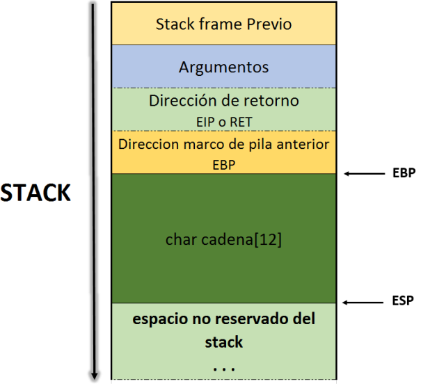

## Buffers Overflows: ¿Que son?

En la programación, se denomina buffer a un espacio de memoria, donde se almacenan ciertos tipos de datos, normalmente se utiliza a la ahora de desarrollo un software o hardware para almacenar y regular datos que luego necesitara el programa o equipo, puede encontrar más información [aquí](https://es.m.wikipedia.org/wiki/B%C3%BAfer_de_datos)

Cuando se declara un buffer con un tamaño prefijado y luego no se controla la cantidad de datos que en el son introducidos, ocurre un desbordamiento, lo que al inglés se traduce como *Buffer Overflow*

**Sintaxis**: `type array[longitud_buffer]`

**Ejemplo**: `char input[50]; //se declara un array que admite 50 caracteres`
           `variable1 = input[49] //máximo`
           `variable2 = input[250] //acceder a la memoria fuera de la array`

**El Stack(Pila)**

La pila o el stack es donde se almacenan los argumentos pasados al programa, las strings del entorno donde está siendo ejecutado el binario, los argumentos pasados a las funciones, las variables locales vacías, y además es donde se almacena el registro IP cuando una función es llamada.

**Ejemplo**

```c++
func() {  
  array[50]  
  return
}  

main() {  
  var1  
  func()  
}  
```


**Registros**

`EBP`: Extended Base Pointer
    
    * Apunta a la base del stack

`ESP`: Extended Stack Pointer
 
    * Señala la parte superior del stack

`EIP`: Extended Instruction Pointer
 
    * Dirección de retorno

 

